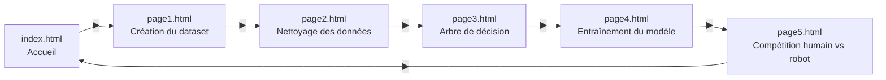
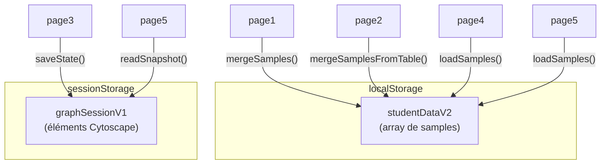
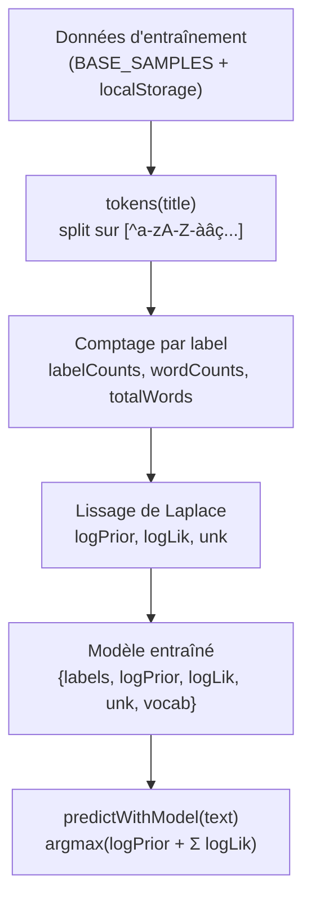

# Ma bulle de recommandation

L'élève parcourt 5 étapes : construction d'un dataset, nettoyage de données, création d'un arbre de décision, entraînement d'un modèle Naive Bayes, et compétition humain vs robot.

> **Stack :** HTML + CSS + Vanilla JS — aucun bundler, aucun framework.  
> **Déploiement :** Pages statiques, hébergeable sur GitHub Pages directement.  
> **Librairies externes :** [Cytoscape.js](https://js.cytoscape.org/) (graphes), [LZ-String](https://pieroxy.net/blog/pages/lz-string/index.html) (compression).

> [!NOTE]
> Les diagrammes ci-dessous utilisent **Mermaid**. Sur GitHub, ils s'affichent automatiquement. Dans VS Code, installez l'extension [Markdown Preview Mermaid Support](https://marketplace.visualstudio.com/items?itemName=bierner.markdown-mermaid).

---

## Navigation et flux



Chaque page a des bulles de navigation ◀ ▶ en haut à droite. La transition entre pages utilise une animation `fadeOut` → `fadeIn`.

---

## Structure des fichiers

| Fichier | Rôle | Éléments clés |
|---|---|---|
| `index.html` | Page titre avec animation de bulles flottantes | Gradient bleu, arrière-plan animé, bouton ▶ |
| `page1.html` | Quiz interactif — l'élève répond à des questions et construit un dataset | Split gauche (quiz) / droite (table). 10 questions. Écrit dans `localStorage`. |
| `page2.html` | Nettoyage de données — l'élève supprime les lignes aberrantes | Table avec données truquées (âge négatif, vues négatives, etc.). Bouton ✖ par ligne. |
| `page3.html` | Éditeur visuel d'arbre de décision avec Cytoscape.js | Drag & drop, clic droit pour relier, double-clic pour renommer. Sauvegardé dans `sessionStorage`. |
| `page4.html` | Entraînement d'un classifieur Naive Bayes sur les données collectées | Tokenisation → comptage → log-prior/log-likelihood. Affiche la précision. |
| `page5.html` | Compétition : l'élève choisit une recommandation vs le modèle entraîné | 4 options par tour, overlay de résultat, score final humain vs robot. |

---

## Persistance des données



### `studentDataV2` (localStorage)

Format : `[{ title, label, source }, ...]`

- **page1** ajoute les réponses du quiz (`source: 'page1'`)
- **page2** synchronise la table visible à chaque suppression (`source: 'page2'`)
- **page4 et page5** lisent les données et les fusionnent avec `BASE_SAMPLES` (100 échantillons hardcodés couvrant 5 catégories : Dessins, Expériences, Animaux, Sciences, Jeux vidéo)
- Dédoublonnage par clé `title.toLowerCase() + '|' + label.toLowerCase()`

### `graphSessionV1` (sessionStorage)

- Arbre de décision construit dans page3, sérialisé en JSON (fallback LZ-String pour la compression)
- page5 le recharge en lecture seule pour affichage

---

## Le modèle Naive Bayes

Implémenté en pur JS dans `page4.html` et `page5.html` (dupliqué dans chaque page).



**Fonctions :**
- `tokens(s)` — tokenise en minuscules, sépare sur les non-lettres
- `trainNaiveBayes(samples)` — retourne le modèle
- `predictWithModel(text, model)` — retourne le label le plus probable

---

## Guide rapide pour modifier

### Changer les questions du quiz (page1)

Modifier le tableau `questions` (~ligne 176 de `page1.html`). Chaque entrée :
```js
{ age: 12, watched: 'Titre vidéo vue', category: 'Catégorie',
  options: ['Option 1', 'Option 2', 'Option 3', 'Option 4'] }
```

### Changer les données à nettoyer (page2)

Modifier les `<tr>` dans le `<tbody id="data-body">` (~lignes 79-109 de `page2.html`). Les données aberrantes à repérer sont celles avec âge négatif/irréaliste, vues négatives, likes > vues, etc.

### Changer les catégories ou les échantillons de base

Modifier `BASE_SAMPLES` dans `page4.html` (~lignes 51-155) **et** `page5.html` (~lignes 178-282). Les 5 catégories actuelles sont : `Dessins`, `Expériences`, `Animaux`, `Sciences`, `Jeux vidéo`.

> [!WARNING]
> `BASE_SAMPLES` est **dupliqué** entre page4 et page5. Si vous modifiez l'un, modifiez l'autre aussi.

### Changer le nombre de tours de la compétition (page5)

La variable `testData` est construite par `buildTestData()` (~ligne 573) : elle prend les 12 premiers échantillons. Modifier le `Math.min(samples.length, 12)` pour changer le nombre de tours.

### Modifier l'arbre de décision (page3)

L'arbre utilise **Cytoscape.js** avec :
- Nœuds `.decision` (diamant vert) et `.leaf` (rectangle bleu)
- Liens créés par clic droit + drag entre nœuds
- Labels éditables par double-clic
- Suppression par drag vers la poubelle

### Ajouter une page

1. Créer `pageN.html` en copiant la structure d'une page existante (CSS commun, nav bubbles, background bubbles)
2. Mettre à jour les liens ◀ ▶ dans la page précédente et la page suivante
3. Le CSS commun (gradient, nav bubbles, animations) est inline dans chaque fichier — il n'y a pas de CSS partagé

### Style global

Chaque page redéfinit le même style. Les constantes visuelles :
- **Gradient :** `linear-gradient(to bottom, #5bc0eb, #20639b)`
- **Police :** `Verdana, sans-serif`
- **Panneaux :** `background: rgba(255,255,255,0.1)`, `border-radius: 8px`
- **Bulles de navigation :** `30×30px`, `border-radius: 50%`, `backdrop-filter: blur(6px)`
- **Animations :** `fadeIn 0.5s`, `fadeOut 0.5s`, `floatUp 30s` (bulles décoratives)
